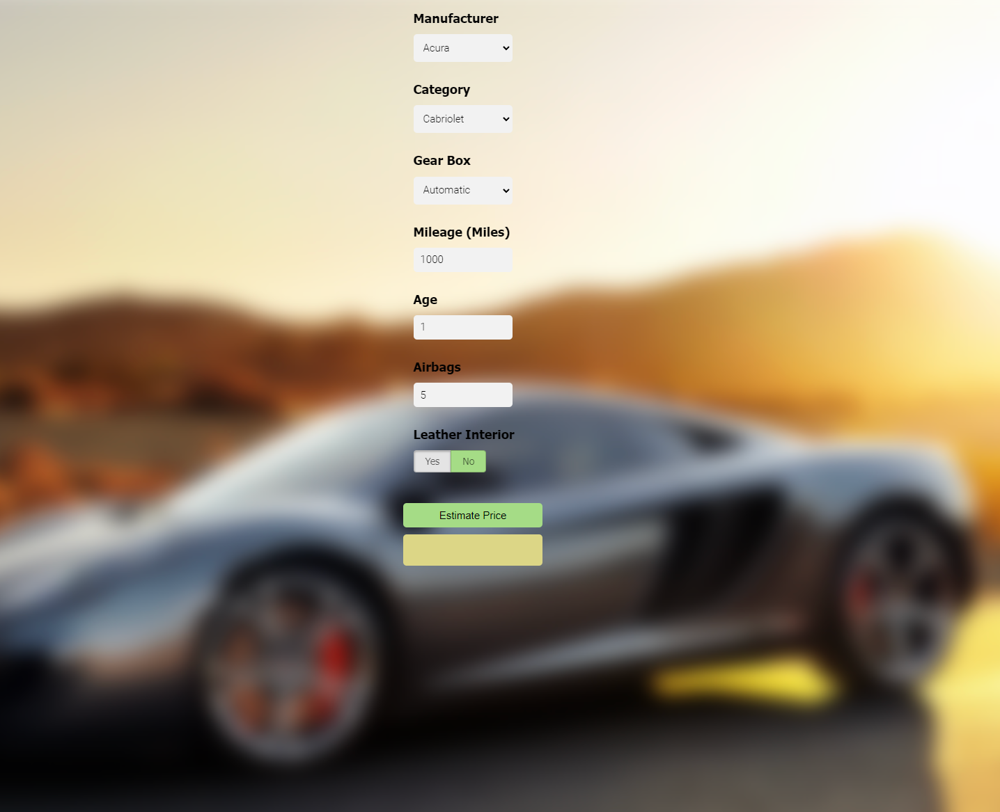

# Car Price Prediction

### Link
>  [Used Car Price Prediction](https://ki3n98.github.io/Portfolio/projects/car_price_prediction/client/CarPricePrediction.html)

## Desciption
I have created a model using the Random Forest Regressor machine learning algorithm from sklearn. The model was trained with a dataset of used car prices obtained from kaggle.com. My next step is to develop a Python Flask server that will use the saved model to handle HTTP requests. The third component of the project is a website built using HTML, CSS, and JavaScript. Users can input the manufacturer, category, gear box, mileage, age, number of airbags, and whether or not they want leather interior. The website will then call the Python Flask server to retrieve the predicted price of the used car.  

During the process of building the model, I utilized various data science techniques, including data loading and cleaning, outlier detection and removal, feature engineering, dimensionality reduction, gridsearchcv for hyperparameter tuning, and k-fold cross-validation. This project covers a broad range of technologies and tools.

## What I learned:

1. Python
2. Numpy and Pandas for data cleaning
3. Matplotlib and seaborn for data visualization
4. Sklearn for model building
5. Jupyter notebook, visual studio code and pycharm as IDE
6. Python flask for http server
7. HTML/CSS/Javascript for UI